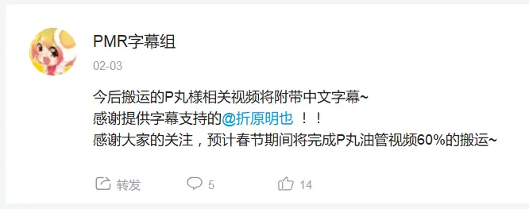

# PMR 字幕组

这可能是个有点长的故事…

## 前世

PMR 字幕组最初叫做 P 丸様搬运组。

2018 年 2 月，我和**折原明也**二人开始着手制作熟肉。

2018 年 2 月 8 日，在白组（现路人豆腐铺）、时空组等组圈内前辈的鼎力相助下，P 丸様搬运组正式成立。新成员的加入使翻译进度突飞猛进，在春节期间达到了最高每日 4 次的更新次数。

2018 年 5 月，因高考原因，我将搬运组的管理工作托付给了**小蘑菇酱**，菇妈牺牲自己的私人时间，使得搬运组仍能有序运转，同时依然保证着视频的稳定更新。

但当我结束高考，重回搬运组时，却又面临着新的难题：没有视频可做了。时至 2018 年中，从 17 年 12 月开始停更的 P 丸依旧没有任何更新视频的动静，而几乎所有的视频我们都已译制完成，当时的我们仍不知这个情况将会持续多久。

2018 年 7 月 10 日，P 丸様搬运组正式更名为 **PMR 字幕组**。

2018 年 9 月，在漫长的等待未果之后，我们决定开始搬运与 P 丸联动过的友人 Ranma、Yucca 等人的视频
。同时全组人近乎疯狂地在 Youtube、Niconico 等平台“搜刮”P 丸曾发布过的视频。同时，小蘑菇酱正在着手进行[杀戮天使录像](https://www.bilibili.com/video/BV1yt411m7qr/)的画面重制，以前无古人的方式费尽心血使这份低画质录像秽土转生。

于是在经过组内的商讨后，在 9 月 22 日的晚上，我怀着复杂的心情写下了这篇文章[《PMR 的未来——我们将何去何从》](https://www.bilibili.com/read/cv1196677)，试图向观众朋友们解释我们现在所处的情况。

## 今生

2018 年 12 月 14 日，P 丸终于在 Youtube 上重新恢复了投稿，PMR 字幕组在此重新启程。

2018 年 12 月 26 日，PMR 字幕组迎来了第 10000 位粉丝。

2019 年 12 月 14 日，我们达成了 20000 粉丝。

2020 年，我们与 P 丸様。的经纪公司取得授权，正式成为官方授权字幕组，海盗时代落幕。

时值 2021 年初，我们已经投稿了 610 余期视频，收获了 1400 万播放，结识了 8 万名喜爱着 P 丸的忠实观众。

**我们一起经历过停更风波，也曾为日更计划忙碌过。**

**感谢热爱之物，让你我相聚结识。**

**一路走来，感谢有你。**

**希望今后也能与你一起，携手谱写 PMR 字幕组的未来。**

## 未来

如果你也被 P 丸的魅力所感染，

想与我们一同为 P 丸人献上高质量的中文字幕，

PMR 字幕组随时欢迎你的加入。

---

PMR 字幕组审核群：164152852

- 翻译：N2 以上，有相关翻译经验者优先
- 校对：有校对经验或较丰富的翻译经验者优先
- 时轴：有 Aegisub 使用经验者优先
