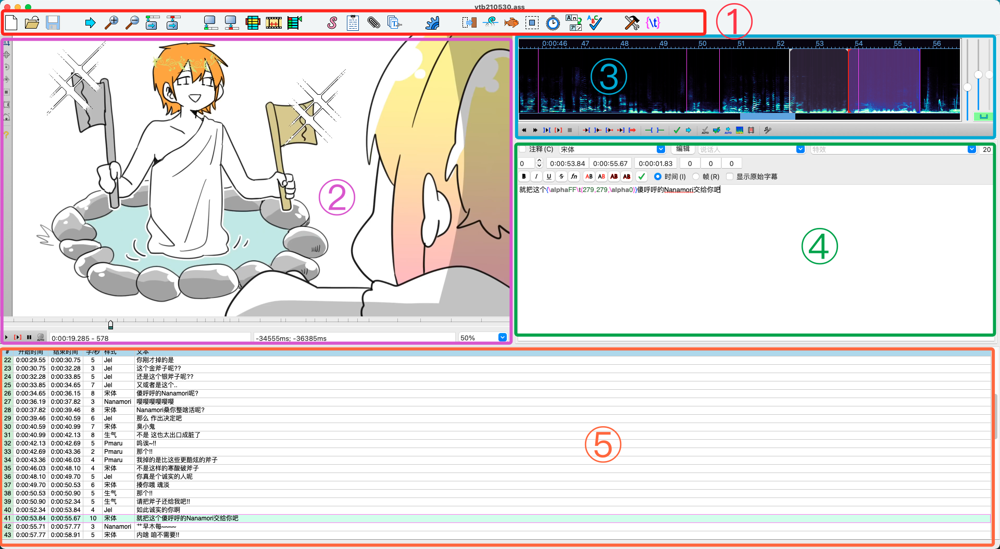
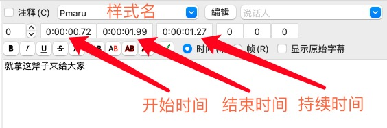

# 时轴基础篇

这一节将介绍时间轴的概念与字幕制作工具 Aegisub 的基本使用方法。

## 什么是时间轴

时间轴所负责的工作就是确定每一行字幕在视频画面上的出现时间与结束时间，简称时轴。除此之外，还可能会负责字幕的样式制作、特效制作。

## 软件工具

本文当主要以 Aegisub 作为时间轴制作工具，它是目前在非商业字幕组中使用较为广泛和通用的跨平台时间轴制作软件之一，它可以输出标准格式的字幕文件，支持 ASS 标签特效与 vsfiltermod 特效制作。

## 下载与安装

对于 Windows 系统用户，请前往[Vmoe 字幕组的 Aegisub 主页](https://aegi.vmoe.info/downloads/)进行下载并安装。建议您遵照提示下载 32 位版本，64 位版本可能导致无法预料的问题。下载安装版或便携版均可，它们之间唯一的区别是安装版需执行安装程序，而便携版无需安装，解压到任意文件夹下即可直接运行。

对于 MacOS 用户，建议您前往[Github](https://github.com/Aegisub/Aegisub/releases)下载最新版的 dmg 镜像，官网主页的旧版本镜像会导致随机闪退问题，极其影响使用。

## 界面组成

1. 工具栏区域：用于快速开启常用的工具与管理器。
2. 视频区：用于预览字幕效果，可视化调整字幕，视频播放控制，查看时间信息及偏移量。
3. 音频区：用于查看声音频谱/波形图，调整字幕时间点，K 轴制作及音频播放控制。
4. 编辑区：用于编辑字幕文字，调整说话人、样式，精确调整时间点等。
5. 字幕区：用于显示整个文件的所以字幕，时间信息及样式信息。

## 视频打轴

不用担心，这一节的内容将十分简单，你只需要记住并使用以下几个快捷键：
:::tip 请注意
MacOS 用户请将下列快捷键中的 Ctrl 替换为 Command
:::

- <kbd>Ctrl + 3</kbd> 设置选定行的开始时间
- <kbd>Ctrl + 4</kbd> 设置选定行的结束时间
- <kbd>Ctrl + P</kbd> 视频播放/暂停
- <kbd>方向键 ← / 方向键 →</kbd> 前进/后退一帧

然后，你只需要按照如下的步骤制作每一行字幕即可：

1. 在文字区输入该行字幕的文字内容，并选择样式（也可以先不选后面统一修改）。你也可以直接在上面的区域修改开始时间、结束时间与持续时间。

2. 在视频区，使用上面的快捷键控制视频播放，并点击播放进度条，使用左右方向键逐帧控制，将进度调整到当前行字幕出现的时间点，按下<kbd>Ctrl + 3</kbd>，这行字幕将出现在视频画面上。
