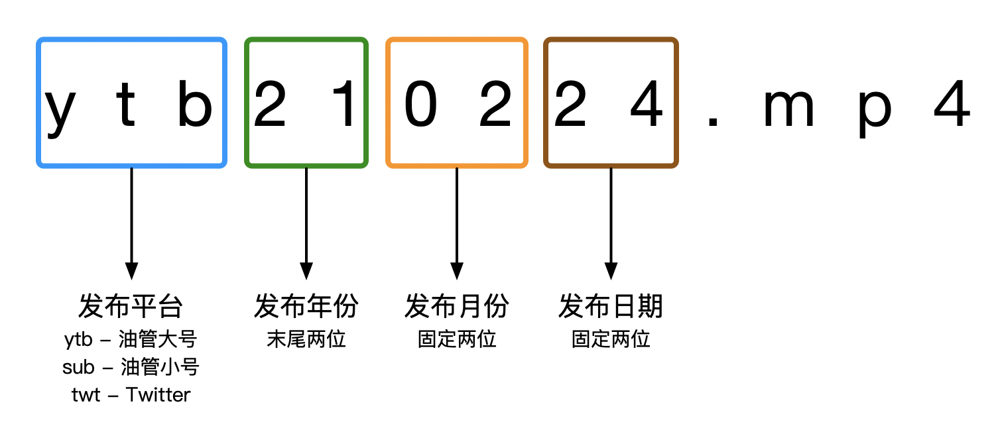

# 工作流

这一节将介绍各职位任务及一般情况下视频译制的两种通用流程。

## 职位任务

:::tip 提示
下列任务分配仅适用于本组，可能与其他字幕组或公认的定义有所不同
:::

|     职位     | 任务                                                                                        |
| :----------: | ------------------------------------------------------------------------------------------- |
|     扒源     | 将原视频（生肉）从视频平台上下载，并上传到组内                                              |
|     翻译     | 翻译视频内的语音/文本，输出翻译文稿                                                         |
|     时轴     | 将翻译文稿按视频时间点制作字幕，输出字幕文件                                                |
|     特效     | 在时轴制作的字幕基础上，使用特效代码或其他手段尽可能还原字幕风格，使其与原字幕/视频画面匹配 |
|     校对     | 根据制作好的翻译/字幕，进一步对翻译的文本校对 纠正语法错误，本土化翻译，调整翻译风格    |
| 后期（终审） | 进行最终的审校，将字幕文件根据校对结果进行修正，同时检查时间轴、视觉效果以及翻译文本        |
|     压制     | 将经过后期的字幕文件与原视频进行压制，输出带字幕的成品视频（熟肉）                          |

## 文件名通用格式

## 串行烤肉

### 适用情况

- 翻译已分配，但时轴未分配（没人接）
- 时轴希望等待翻译文稿完成后再进行打轴

### 流程

1.  扒源
2.  翻译进行翻译
3.  时轴等待翻译完成后，进行时间轴制作
4.  ~~组长~~分配给校对，进行翻译修正
5.  ~~组长~~终审进行最终审校，确认无误后压制上传投稿

## 空轴先行

:::tip 什么是空轴？
空轴一般指无翻译文本的字幕文件，每条字幕的时间已经指定好，填上翻译文本即可直接交工。
:::

### 适用情况

- 时轴已分配，但翻译未分配（没人接）
- 翻译可以使用 Aegisub 直接在空轴上进行翻译工作（请事前协商）

### 流程

1. 扒源
2. 时轴进行空轴制作
3. 如翻译不会使用 Aegisub，则时轴将在空轴完成后手动将翻译文本填入字幕文件
4. 如翻译会使用 Aegisub，翻译可等待空轴完成后直接在字幕文件上填写翻译文本，**请双方提前进行协商采用哪种方式**
5. ~~组长~~分配给校对，进行翻译修正
6. ~~组长~~终审进行最终审校，确认无误后压制上传投稿
