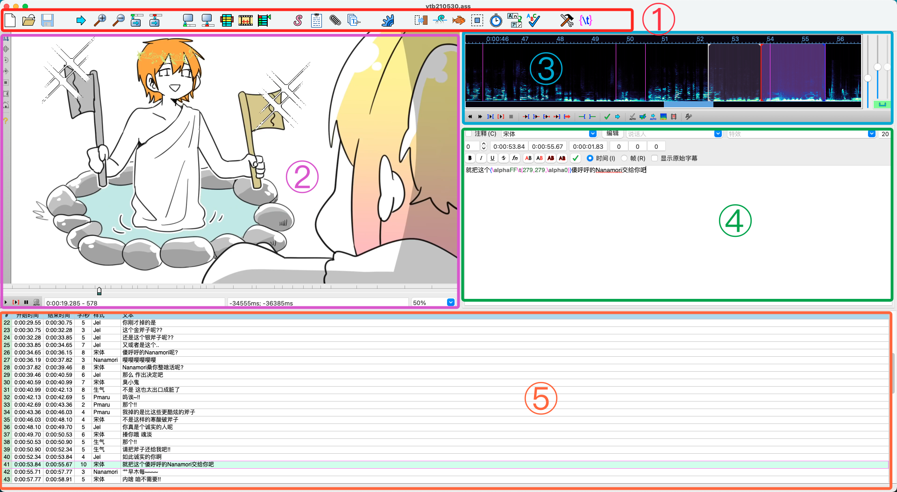
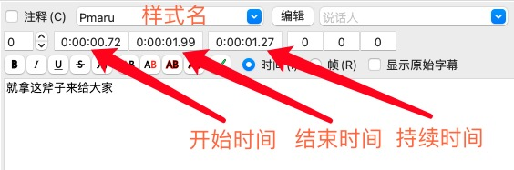
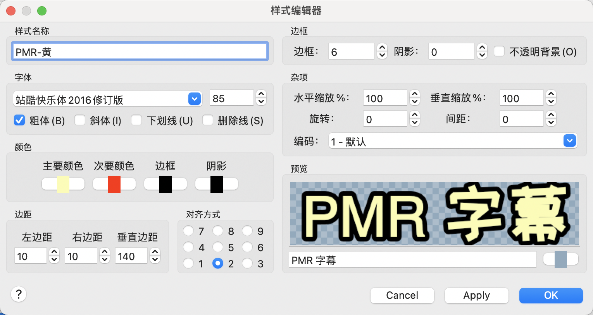
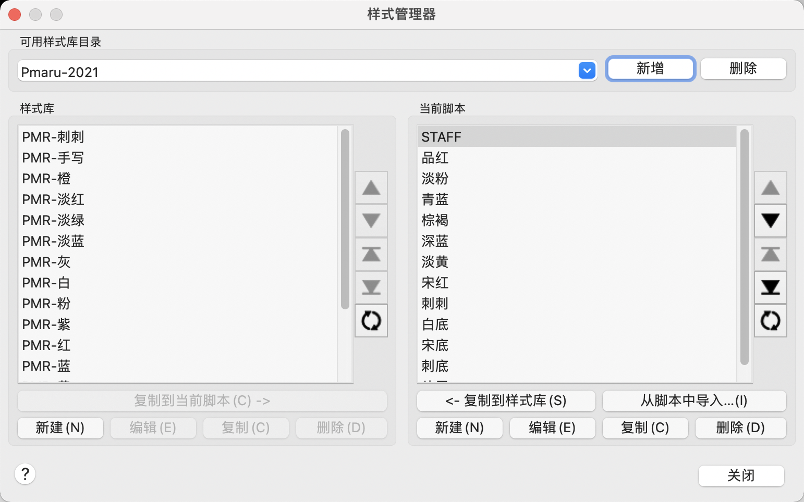

# 基础篇

这一节将介绍时间轴的概念与字幕制作工具 Aegisub 的基本使用方法。

## 什么是时间轴

时间轴所负责的工作就是确定每一行字幕在视频画面上的出现时间与结束时间，简称时轴。除此之外，还可能会负责字幕的样式制作、特效制作。

## 软件工具

本文当主要以 Aegisub 作为时间轴制作工具，它是目前在非商业字幕组中使用较为广泛和通用的跨平台时间轴制作软件之一，它可以输出标准格式的字幕文件，支持 ASS 标签特效与 vsfiltermod 特效制作。

## 下载与安装

对于 Windows 系统用户，请前往[Vmoe 字幕组的 Aegisub 主页](https://aegi.vmoe.info/downloads/)进行下载并安装。建议您遵照提示下载 32 位版本，64 位版本可能导致无法预料的问题。下载安装版或便携版均可，它们之间唯一的区别是安装版需执行安装程序，而便携版无需安装，解压到任意文件夹下即可直接运行。

对于 MacOS 用户，建议您前往[Github](https://github.com/Aegisub/Aegisub/releases)下载最新版的 dmg 镜像，官网主页的旧版本镜像会导致随机闪退问题，极其影响使用。

## 界面组成

1. 工具栏区域：用于快速开启常用的工具与管理器。
2. 视频区：用于预览字幕效果，可视化调整字幕，视频播放控制，查看时间信息及偏移量。
3. 音频区：用于查看声音频谱/波形图，调整字幕时间点，K 轴制作及音频播放控制。
4. 编辑区：用于编辑字幕文字，调整说话人、样式，精确调整时间点等。
5. 字幕区：用于显示整个文件的所以字幕，时间信息及样式信息。

## 时间轴制作

不用担心，这一节的内容将十分简单，你只需要记住并使用以下几个快捷键：
:::tip 请注意
MacOS 用户请将下列快捷键中的 Ctrl 替换为 Command
:::

- <kbd>Ctrl + 3</kbd> 设置选定行的开始时间
- <kbd>Ctrl + 4</kbd> 设置选定行的结束时间
- <kbd>Ctrl + P</kbd> 视频播放/暂停
- <kbd>方向键 ← / 方向键 →</kbd> 前进/后退一帧

然后，你只需要按照如下的步骤制作每一行字幕即可：

1. 在文字区输入该行字幕的文字内容，并选择样式（也可以先不选后面统一修改）。你也可以直接在上面的区域修改开始时间、结束时间与持续时间。如已经存在翻译稿件，可以将 txt 格式的翻译稿直接拖动到字幕区，点击确定导入，Aegisub 会进行自动分割。
   

2. 在视频区，使用上面的快捷键控制视频播放，并点击播放进度条，使用左右方向键逐帧控制，将进度调整到当前行字幕出现的时间点，按下<kbd>Ctrl + 3</kbd>，这行字幕将出现在视频画面上。当然，你也可以使用视频区的播放按钮播放到你想要开始的位置，再按键确定开始时间。但对于 P 丸的视频，在有日文原字幕的情况下请将开始和结束时间以帧为单位与原字幕保持一致。

3. 步骤同上，按下<kbd>Ctrl + 4</kbd>设定本行字幕的结束时间，当前的时间将为本行字幕出现的最后一帧。

4. 使用鼠标点击、方向键或在字幕区/编辑区按下<kbd>Enter</kbd>键切换到下一行，重复步骤 2-3。

本节介绍的方法更适用于原视频带有字幕的情况，对于没有原字幕或不需要对帧的视频（如生放送等），将在[时轴进阶篇](/tutorial/timeline/timeline-advanced)介绍更为高效快速的 **Medusa 热键打轴法**。

在更改字幕样式时，你可以每行字幕逐一在下拉框中修改，也可以用鼠标在字幕区长按并拖动或长按<kbd>Ctrl / Command</kbd>，选中多行字幕后统一修改。对于多种样式的快速调整，将在[时轴进阶篇](/tutorial/timeline/timeline-advanced)介绍更为十分好用的 **样式助手** 功能。

## 字幕样式

上节我们介绍了如何使字幕在正确的时间出现在视频画面上，本节我们将介绍如何调整字幕的样式与视觉效果。

### 样式编辑面板

点击编辑区样式名旁边的编辑按钮，或在样式管理器中点击编辑，即可呼出样式编辑面板。

以组内第二版样式参考中的 PMR-黄样式为例，在这个界面你可以调整此样式的字体、字号、字体颜色、边框颜色、边框宽度和阴影大小等等样式参数。其中，次要颜色这一项一般无需调整，只有在制作 K 轴效果时才会用到此项参数。

常用参数的含义较简单，无需赘述，大多数情况下只需在组内规范提供的样式基础上调整主要颜色和字号大小即可。

### 样式管理器

在上方「字幕」菜单中点击「样式管理器」，即可呼出此面板。

左侧的样式库，是存储在你本地的字幕样式，你可以新建编辑删除复制或将其中一些样式复制到当前的 ASS 字幕文件中。右侧的则是当前 ASS 文件中拥有的字幕样式，也就是你在编辑区的样式下拉框能够选择的样式。如果你新建了一个空白 ASS，左侧默认样式库的所有样式将会自动复制到你新建的这个 ASS 文件中。

对于右侧当前文件中存在的样式，除正常的新建和编辑外，一个常用的操作是复制。选中任意一个样式，点击复制，则会复制一个与你选中样式一样的新字幕样式，你可以在这个基础上进行微调，生成另一个样式。比如视频中需要多个角色的对话字幕用相同字体和字号，但颜色不同的字幕区分，则可以使用复制方法，将一个字幕样式做为基准，复制出不同的样式，只需更改颜色即可。

## 小结

至此，时轴基础篇的教程就告一段落了。熟悉了本章所描述的操作后，即可满足大部分字幕制作的需求。下一章时轴进阶篇，将会介绍一些常用的操作技巧与更丰富的字幕效果制作方法。

如果你感觉文字比较枯燥或不太直观，可移步 Bilibili 观看我在 2020 年组内教学时录制的[Aegisub 基本操作/效果标签从入门到如土](https://www.bilibili.com/video/BV1FT4y1J7XK)。此视频中部分解释或操作可能存在谬误，请结合本文档一同食用。

预计 2021 年下半年，我将会以此文档为基础录制全新的时轴系列教程，敬请期待。
